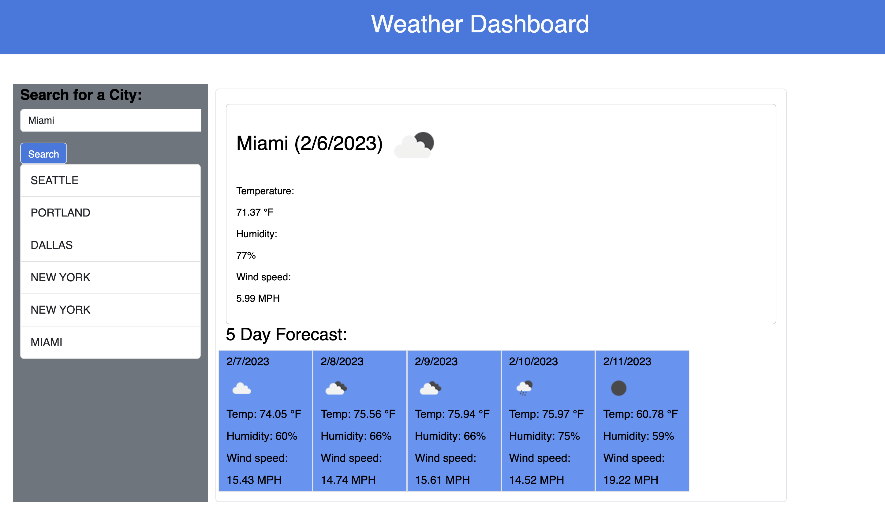

# Weather Dashboard

# Description
This application is a weather dashboard that uses a third party weather API and will run in the browser, featuring dynamically updated HTML and CSS. It's deployed to a live website hosted on GitHub Pages.

# Application Screenshot: 

## Table of Contents   
* [Description](#description)
* [Usage](#usage)
* [Contributing](#contributing)
* [Questions](#questions)

# Usage:
View the live application on GitHub Pages: https://nelson92.github.io/weather-dashboard/

## Contributing
No guidelines for this project

## Questions:
GitHub: nelson92
nelson509@gmail.com

